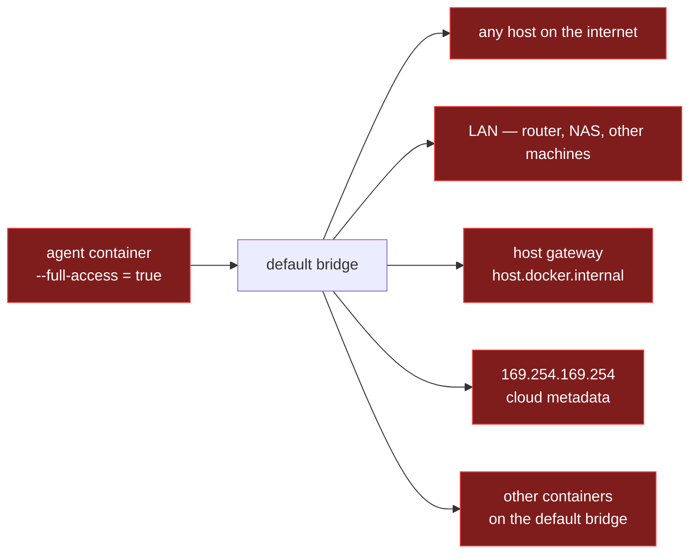
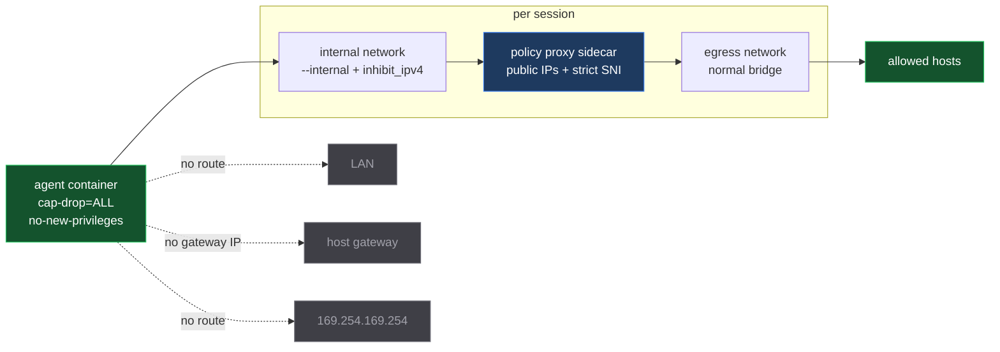
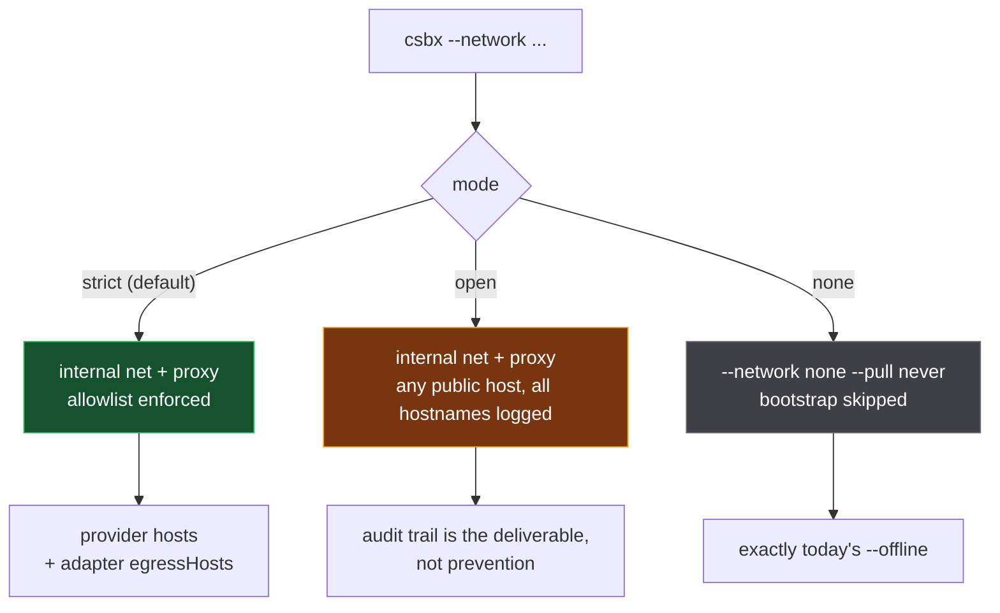
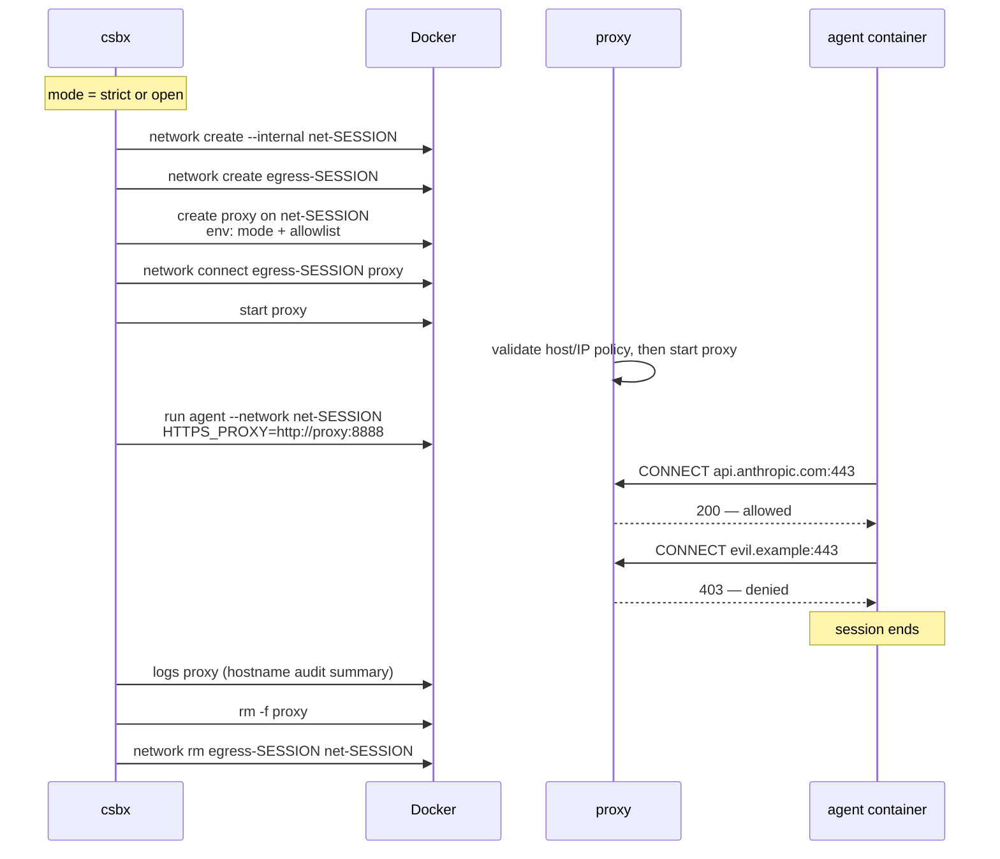
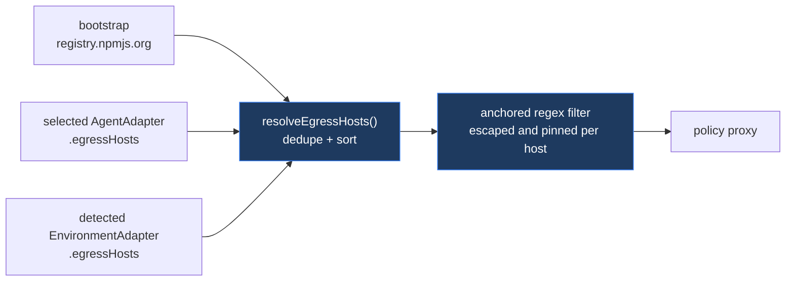
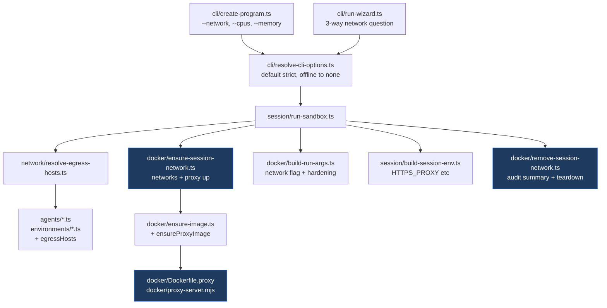
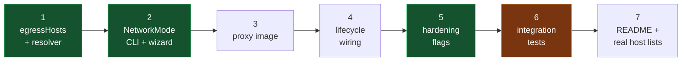
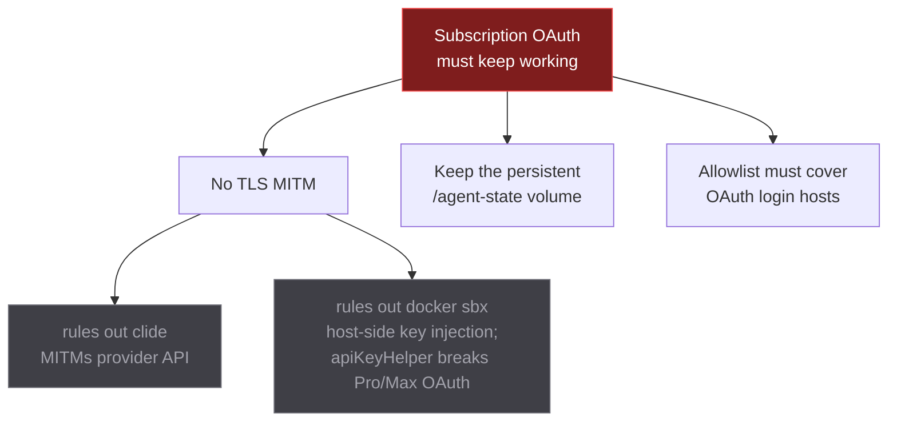
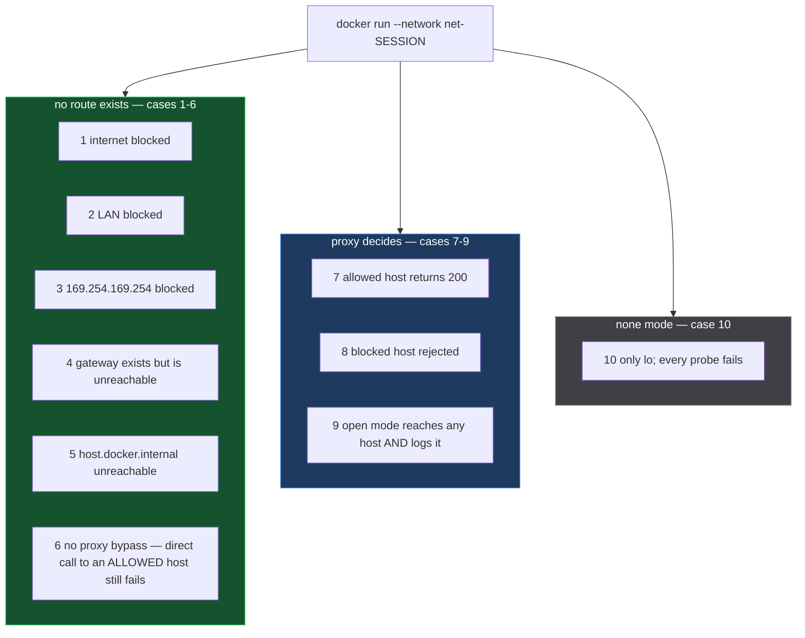

# Network Hardening — Implementation Plan

> The visual companion to [network-hardening.md](./network-hardening.md). That
> document is the specification and the reasoning; this one is what actually gets
> built, in what order, and how to tell when it works.

---

## 1. The change in one picture

### Today

The container gets no `--network` flag at all, so it lands on Docker's default
bridge with unrestricted access to everything.



### After

The agent joins **one internal network with no usable route off it**. The only
other member is a proxy it does not control.

The network needs `--internal` **and**
`--opt com.docker.network.bridge.inhibit_ipv4=true`. `--internal` alone leaves
the bridge gateway reachable, and that gateway is the Docker host - measured, see
§9.



The proxy **never terminates TLS**. It reads the hostname from the `CONNECT`
line, decides yes or no, and then blindly pipes bytes. This is not a nicety —
see §7.

---

## 2. Three modes replace `--offline`



| Mode                 | Agent network    | Egress                              | Bootstrap |
| -------------------- | ---------------- | ----------------------------------- | --------- |
| `strict` _(default)_ | internal + proxy | provider hosts + `egressHosts`      | full      |
| `open`               | internal + proxy | any public hostname, every hostname logged | full      |
| `none`               | `--network none` | nothing                             | skipped   |

`--offline` survives as a deprecated alias for `--network none` and warns.

Note that even `open` keeps the internal-network topology, so it still closes the
LAN, host-gateway and metadata paths. `open` widens the **host** set only — the
proxy stays `CONNECT :443`-only, so SSH and raw sockets fail in every mode.

---

## 3. Session lifecycle

Create → connect → start, in that order, so the proxy never runs without its
egress leg and there is nothing to poll for readiness.



Teardown goes in the `finally` block that already calls `pruneStaleVolumes`, and
is best-effort with a warning on failure.

**Names are deterministic**, derived from the existing container-name hash:

```
coding-agent-sandbox-net-<session>       internal
coding-agent-sandbox-egress-<session>    egress
coding-agent-sandbox-proxy-<session>     proxy
```

All carry the existing `com.pixpilot.sandbox` labels. Determinism means a crashed
session leaves objects that the next run of the same session removes before
recreating — so a stale proxy can never be adopted with the wrong allowlist.

---

## 4. Where the allowlist comes from



`egressHosts` is one new readonly field, defaulting to `[]`, on both adapter base
classes — so a new language declares its registries next to its install command,
and a new agent declares its provider next to its login probe.

| Source            | Hosts                                                                                        |
| ----------------- | -------------------------------------------------------------------------------------------- |
| bootstrap         | `registry.npmjs.org`                                                                         |
| Claude Code       | `api.anthropic.com`, `console.anthropic.com`, `statsig.anthropic.com`, **OAuth login hosts** |
| OpenAI Codex      | `api.openai.com`, `auth.openai.com`, `chatgpt.com`                                           |
| Copilot CLI       | `api.github.com`, `api.githubcopilot.com`, `github.com`                                      |
| Node              | `registry.npmjs.org`                                                                         |
| Go _(future)_     | `proxy.golang.org`, `sum.golang.org` — with `GOPROXY` minus `,direct`                        |
| Rust _(future)_   | `index.crates.io`, `static.crates.io`                                                        |
| Python _(future)_ | `pypi.org`, `files.pythonhosted.org`                                                         |

> **These lists are unverified guesses and must be corrected empirically.**
> Method: run each agent in `open` mode and read the hostnames out of the proxy
> log. Do this **including a fresh `/login`**, not just a working session — login
> hits different hosts (`claude.ai`, `platform.claude.com`) and is the first thing
> that breaks in `strict` on an empty auth volume.

**Filter entries are anchored.** Tinyproxy regexes are unanchored, so a bare
`registry.npmjs.org` would also match `registry.npmjs.org.attacker.example`. Hosts
are validated and their dots escaped before rendering; an entry that fails
validation is a hard error, not a dropped line.

---

## 5. What each file does



**New**

| File                                   | Does                                               |
| -------------------------------------- | -------------------------------------------------- |
| `docker/Dockerfile.proxy`              | Unprivileged Node proxy image                      |
| `docker/proxy-server.mjs`              | Public-IP, strict-host and TLS-SNI enforcement     |
| `src/network/network-mode.ts`          | `NetworkMode` type + parser                        |
| `src/network/resolve-egress-hosts.ts`  | Compose, dedupe, validate, render filter lines     |
| `src/network/session-network-names.ts` | Deterministic names from the session identity      |
| `src/docker/ensure-session-network.ts` | Create networks, create/connect/start the proxy    |
| `src/docker/remove-session-network.ts` | Read `docker logs`, print audit, remove everything |

**Modified**

`constants.ts` · `types.ts` · `cli/create-program.ts` · `cli/resolve-cli-options.ts` ·
`cli/run-wizard.ts` · `docker/build-run-args.ts` · `docker/ensure-image.ts` ·
`docker/prune-volumes.ts` _(extend to stale networks + proxy containers)_ ·
`session/build-session-env.ts` · `session/run-sandbox.ts` ·
`session/print-session-summary.ts` · `agents/agent-adapter.ts` + the three agents ·
`environments/environment-adapter.ts` + `node-environment.ts` · `README.md`

### The `docker run` diff

```diff
  docker run --rm -it
    --name coding-agent-sandbox-claude-<task>-<hash>
    --label com.pixpilot.sandbox=1
    ...
-   [--network none --pull never]        # only when --offline
+   --network coding-agent-sandbox-net-<session>     # strict | open
+   # or: --network none --pull never                # none
+   --cap-drop=ALL
+   --security-opt=no-new-privileges
+   --pids-limit 512
+   [--cpus <n>] [--memory <size>]       # only when the user asks
    -v <worktree>:/workspace
    ...
+   -e HTTPS_PROXY=http://coding-agent-sandbox-proxy-<session>:8888
+   -e HTTP_PROXY=...  -e NO_PROXY=localhost,127.0.0.1
```

CPU and memory stay **unconstrained by default** — build tools and test suites
are the workload, and silently capping them is a regression.

---

## 6. Build order

Each step is independently shippable and independently revertable.



| #   | Step                                                                    | Docker needed? | Notes                                           |
| --- | ----------------------------------------------------------------------- | -------------- | ----------------------------------------------- |
| 1   | `egressHosts` on both adapters + resolver                               | no             | Pure, unit-tested                               |
| 2   | `NetworkMode`, `--network`, wizard, plumbing                            | no             | Behaviour change is only `none` = old `offline` |
| 3   | `Dockerfile.proxy` + policy proxy                                       | yes            | Verifiable standalone by hand before wiring     |
| 4   | `ensure`/`remove-session-network` in run-sandbox                        | yes            | The real switch-on                              |
| 5   | `--cap-drop`, `no-new-privileges`, `--pids-limit`, `--cpus`, `--memory` | no             | ~10 lines, orthogonal                           |
| 6   | Integration suite                                                       | yes            | Opt-in, gated by env var                        |
| 7   | README + corrected host lists from step 6                               | —              | Host lists come **out** of testing, not into it |

> **Steps 1, 2 and 5 are worth landing on their own even if the perimeter is
> later abandoned.** Step 2 fixes the documented `--offline` bug; step 5 is free
> hardening. Consider them PR #1, and steps 3–7 as PR #2.

---

## 7. Constraint that rules everything else out

**The $20 subscription plans authenticate by OAuth, in-container.** This is not a
preference; it eliminates every alternative and fixes three design choices:



- **No MITM** — intercepting TLS breaks OAuth login and token refresh.
- **`/agent-state` stays mounted** — `~/.claude/.credentials.json` must survive
  between sessions or you re-login every run. Credential scoping is a **separate
  follow-up**, not a conditional hack in this change.
- **Login hosts are allowlisted** — otherwise `strict` fails before the agent runs.

Alternatives evaluated and rejected: `docker sbx` (proprietary, separate install,
KVM on Linux, subscription OAuth second-class and historically broken),
`itscooleric/clide` (MITM, `NET_ADMIN` in the agent container, 2 stars),
`agent-of-empires` (excellent orchestration, but Linux/macOS only and no network
perimeter), `kubernetes-sigs/agent-sandbox` (needs a cluster; disproportionate).

---

## 8. How we know it works

### Unit — existing vitest suite, no Docker

- `buildRunArgs` per mode; hardening flags always; resource flags only when set
- `resolveEgressHosts` composition, dedupe, ordering
- Filter rendering: anchoring, dot escaping, `*.` expansion, invalid host rejected
- `buildSessionEnv`: proxy vars in `strict`/`open`, absent in `none`
- Deterministic naming

### Integration — opt-in, needs Docker

New `test/integration/`, gated behind an env var, because the shared vitest config
runs in CI without Docker.



Plus one cheap extra: `CONNECT` to port 22 refused even in `open`, proving
`ConnectPort 443`.

**Cases 1–6 exist because the spec refuses to simply assert that `--internal`
blocks everything.** They must run on Windows/Docker Desktop, Linux Docker Engine
and macOS/Docker Desktop before release. A difference on any of the three is a
finding, not a broken test environment.

### Manual, per agent

Launch each of Claude / Codex / Copilot in `strict` and confirm: OAuth login
completes, the agent answers a prompt, and whether web search and URL fetch still
work. Record the answers in the README.

---

## 9. What could stop this

| Risk                                                                                                                                                                                                                                                                                                                                                                                                                                   | Impact                                                                                                                        | When we find out |
| -------------------------------------------------------------------------------------------------------------------------------------------------------------------------------------------------------------------------------------------------------------------------------------------------------------------------------------------------------------------------------------------------------------------------------------- | ----------------------------------------------------------------------------------------------------------------------------- | ---------------- |
| **An agent CLI ignores `HTTPS_PROXY`.** Node 22's `fetch` does not apply proxy env vars automatically. Claude Code documents that it honours it; Codex and Copilot are unverified.                                                                                                                                                                                                                                                     | `strict` **and** `open` are both unusable for that agent                                                                      | Step 3–4         |
| **TLS ClientHello compatibility.** Strict mode parses the initial ClientHello and requires SNI to equal the CONNECT hostname; malformed, ECH-only or SNI-less handshakes fail closed.                                                                                                                                                                                                                                              | A non-standard TLS client may need `open` mode                                                                                 | Integration suite |
| **OAuth login hosts missing from the allowlist**                                                                                                                                                                                                                                                                                                                                                                                       | First run on a fresh auth volume cannot log in                                                                                | Step 7 testing   |
| **`--internal` alone leaves the host reachable — CONFIRMED, then fixed.** An `--internal` network still has a gateway IP, and that gateway is the Docker host; a container on one reached a host process listening on `0.0.0.0`. Fixed by also passing `--opt com.docker.network.bridge.inhibit_ipv4=true`, leaving the bridge with no address. Re-verified after the change: host unreachable, embedded DNS and the proxy still work. | Would have left T3 open on every platform, and worse on Linux Docker Engine where the gateway is the developer's real machine | Found in step 3  |
| **`--internal` behaves differently on Docker Desktop**                                                                                                                                                                                                                                                                                                                                                                                 | Portability claim fails                                                                                                       | Step 6, case 1–6 |
| **Server-side vs client-side web search**                                                                                                                                                                                                                                                                                                                                                                                              | If client-side, `strict` breaks research tasks                                                                                | Manual testing   |

**Known, accepted breakages** — no preflight detection, no capability matrix. They
fail closed, and a non-zero exit in `strict` prints:

> This operation may require a host or protocol blocked by strict network mode.
> Retry with `--network open` if you trust this operation.

- Git over SSH — no port 22 through an HTTP proxy. HTTPS remotes still work.
- Tools using raw sockets.
- DNS-based exfiltration is **out of scope**. The goal is to remove the easy
  outbound paths and make the rest auditable, not data-loss prevention.
