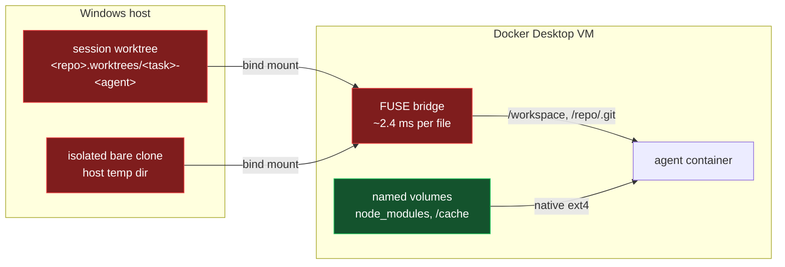
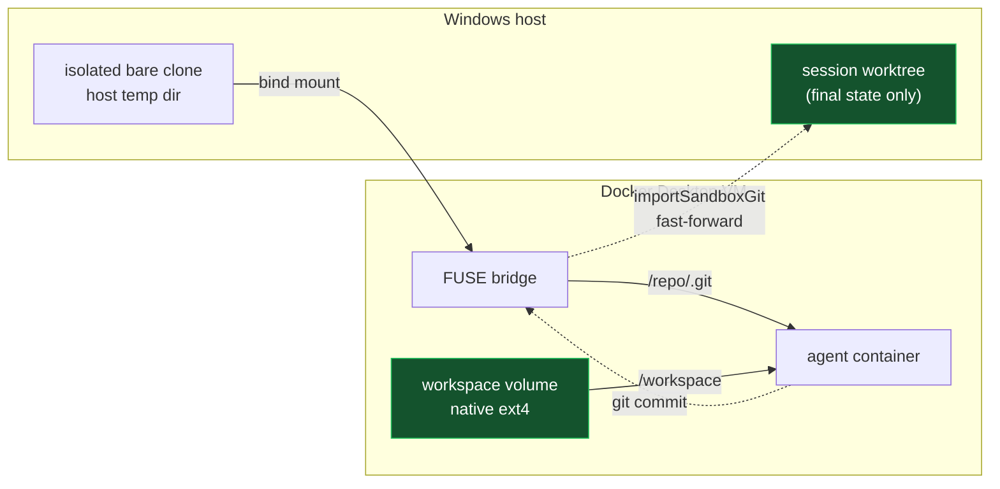

# Workspace Filesystem Performance — Options

> Not built. This is the case for a change that has not been decided yet.
> Everything below the measurement tables is a proposal; the measurements
> themselves are real and reproducible.
>
> Measured 2026-09-09 on Windows 10 Pro, Docker Desktop on the **Hyper-V**
> backend (`wslEngineEnabled: false`), 24 CPUs / 32 GB VM, repository on `Z:\`.

---

## 1. The problem

Every file operation the agent performs on `/workspace` crosses the
Windows-to-Linux filesystem bridge. On this host that costs roughly three orders
of magnitude.

Same container, same 218 tracked files, one copy bind-mounted from `Z:\` and one
copy in a Docker named volume:

| Operation                              | Bind mount (FUSE) | Named volume | Ratio   |
| -------------------------------------- | ----------------- | ------------ | ------- |
| `git status -uno`                      | 5,530 ms          | 2 ms         | ~2,700x |
| `git diff --stat`                      | 8,884 ms          | 1 ms         | ~8,800x |
| `git status` (full, with node_modules) | 17,620 ms         | 5 ms         | ~3,500x |

And from a live session, on the real worktree:

| Operation                 | Bind mount (FUSE)       | Named volume          | Ratio |
| ------------------------- | ----------------------- | --------------------- | ----- |
| directory traversal       | 5,525 files / 13,013 ms | 38,442 files / 451 ms | ~200x |
| 200 sequential file reads | 2,836 ms                | 126 ms (overlay2)     | ~22x  |

This is the dominant cost in a slow session. It is not the agent, not Turbo, and
not the proxy.

### Reproducing it

```bash
docker exec <container> bash -c 'grep -E " /workspace" /proc/self/mountinfo'
# → /workspace rw,user_id=0,group_id=0,allow_other,max_read=1048576
#   the FUSE options identify the Docker Desktop host bridge

docker exec <container> bash -c \
  'cd /workspace && s=$(date +%s%N); git status -uno --porcelain >/dev/null; \
   e=$(date +%s%N); echo "$(( (e-s)/1000000 ))ms"'
```

---

## 2. Where the time goes today

Both hot paths are on the host filesystem: the working tree _and_ the Git object
store. Anything Git does pays the bridge cost twice.



`node_modules` and `/cache` are already named volumes, which is exactly why they
are fast. The proposal is to extend that to the workspace itself.

---

## 3. Why this is a smaller change than it looks

**The host and the container already exchange commits, not files.**

`prepareSandboxGit` clones the repository `--no-local` into a private host temp
directory, and `importSandboxGit` fast-forwards it back into the host branch with
real guarantees:

- refuses history that no longer descends from the session base commit
- refuses to overwrite a host branch that moved during the session
- transfers objects before moving any ref
- `update-ref` with an expected old value, so a concurrent host update fails
  closed
- host hooks disabled during the final `reset --mixed`

That is already a safe sync channel. The bind mount of `/workspace` is not what
delivers the agent's work to the host — it only makes uncommitted files visible
while the session runs.

---

## 4. Proposal: volume-backed workspace

Move only the working tree. Leave the Git directory where it is.



| Concern           | Design                                                                   |
| ----------------- | ------------------------------------------------------------------------ |
| `/workspace`      | Per-worktree named volume, keyed like the existing `node_modules` volume |
| `/repo/.git`      | **Unchanged** host bind mount                                            |
| Seeding           | `git checkout` inside the container on first start                       |
| Sync back to host | **Unchanged** — `importSandboxGit` still reads the host bare clone       |
| Host worktree     | Still created, still `reset --mixed`; final state identical to today     |

Keeping `.git` on the host is what makes this cheap: `importSandboxGit` runs
_after_ the container exits, so it must not depend on the container still being
alive. The working tree is where the millions of stats happen; the object store
is comparatively cold.

Verified: seeding this repository into an empty volume via `git checkout` took
**863 ms** for 218 files.

### If the Git directory ever moves into the volume too

Git can read from a container-resident repository over stdio with no mount at
all. Verified working:

```bash
git -c protocol.ext.allow=user fetch \
  "ext::docker exec -i <container> git-upload-pack /workspace" \
  main:refs/heads/from-sandbox
```

The `-c protocol.ext.allow=user` is required — `ext` is blocked by default, the
same way the codebase already passes `-c protocol.file.allow=always`. Note this
only works while the container is alive, so the teardown order would have to
change, or a short-lived helper container would have to mount the volume.

---

## 5. What this costs

- **No live view of uncommitted work.** You cannot watch the worktree change
  mid-session in an editor. This is the entire trade.
- Nothing is lost when the container dies: named volumes survive `--rm`, so a
  throwaway container can always recover the contents.
- A `peek` / `sync` subcommand could fetch mid-session on demand if the loss of
  live visibility turns out to matter.

### Risks to design around

- **`pruneVolumes` must not touch a workspace volume holding unimported work.**
  Worktree-keyed dependency volumes are labelled prunable and swept
  automatically. Applying that to the workspace would silently destroy
  uncommitted changes. This is the one genuinely dangerous edge.
- Recovery path needs to be documented, not just possible — a user whose session
  crashed should be told the volume name.
- Seeding must be idempotent: reusing an existing session must not re-checkout
  over the agent's work.

---

## 6. Rejected alternatives

**Bidirectional file sync (mutagen, docker-sync, syncthing).** Re-couples the
host to the container — the exact boundary the sandbox exists to enforce. Adds a
daemon, ignore lists, and conflict/corruption modes under mass rewrites
(installs, codegen). Still has to read the same files. The Git path already
provides safe sync with real guarantees; a file syncer provides fewer.

**Put the worktree on the WSL2 filesystem.** The right answer on a WSL2 host, and
not available here: Docker Desktop is on the Hyper-V backend
(`wslEngineEnabled: false`), and the only distros present are `docker-desktop`
and `docker-desktop-data`, both stopped. Adopting it means switching the Docker
Desktop backend, installing a user distro, and relocating repositories into it —
a workstation change, not a change to this package. Revisit if the backend
changes.

**Lower concurrency (`TURBO_CONCURRENCY`, `RAYON_NUM_THREADS`).** Treats a
symptom of the PID ceiling, not the filesystem, and leaves every parallel
toolchain fragile. Superseded by the `--pids-limit` change.

---

## 7. Adjacent, already fixed

The 512 PID ceiling was a separate defect with overlapping symptoms. The cgroup
v2 `pids` controller counts threads, not processes; an idle agent runtime held
~440 of 512 tasks, so a fan-out build hit `EAGAIN` and retried. The default is now
4096 and tunable with `--pids-limit`. Retry storms from that ceiling made sessions
feel slower than the filesystem alone accounts for, but the bridge cost in
section 1 survives the fix.

---

## 8. Free thing to try first

Windows Defender real-time protection is enabled on this host. Excluding the
repository root and `com.docker.backend.exe` often reduces bind-mount I/O cost
substantially. It does not remove the bridge, only a multiplier on it — but it
costs a minute and needs no code.

---

## 9. Open questions

1. Is losing the live view of uncommitted files acceptable, or does a `peek`
   command have to ship at the same time?
2. Opt-in flag (`--workspace volume|bind`, default `bind`) or new default?
3. Does the workspace volume get its own retention policy, separate from the
   prunable dependency volumes?
4. Is per-worktree the right key, or should a workspace volume be per-session?
